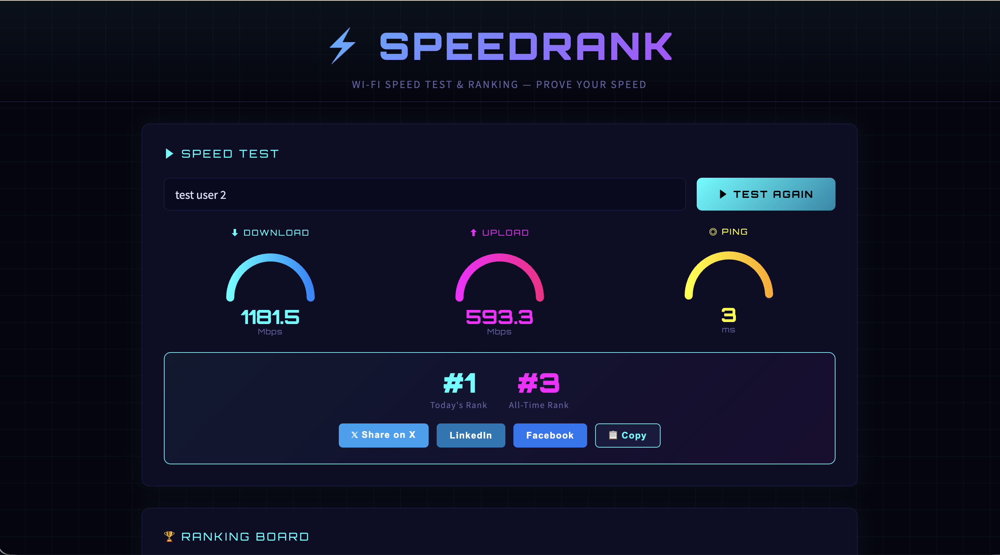
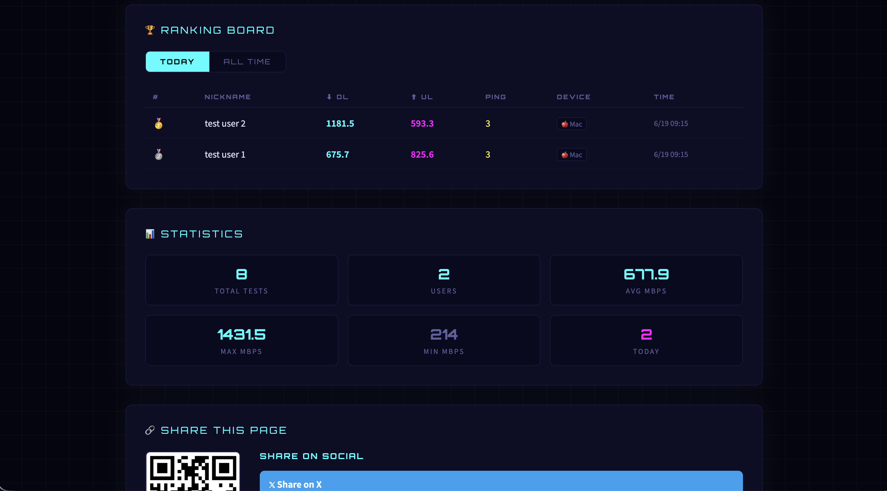

[](LICENSE)

# ⚡ SpeedRank — Wi-Fi スピードテスト & ランキング

Wi-Fiの速度を計測してリアルタイムランキングで競い合えるWebアプリです。  
ローカルまたはDockerで起動し、同一ネットワーク上のどのブラウザからでもアクセスできます。

## スクリーンショット




## 機能

- 📶 ダウンロード / アップロード速度・Pingの計測
- 🏆 本日のランキング & 歴代ランキング（TOP 50）
- 📊 統計情報：テスト総数・ユーザー数・平均/最大/最小速度
- 📱 デバイス判定（iPhone / Android / iPad / Mac / Windows / Linux）
- 📷 モバイルアクセス用QRコード生成
- 🔗 X (Twitter) / LinkedIn / Facebook へのシェア機能
- 💾 SQLiteによるデータ永続化
- 📐 レスポンシブデザイン（モバイル / タブレット / PC）

## 技術スタック

- Node.js + Express
- SQLite（better-sqlite3）
- Vanilla HTML / CSS / JavaScript
- QRCode.js

## Dockerで起動（推奨）

```bash
git clone https://github.com/kshimonoj/speedtest.git
cd speedtest
docker compose up -d
```

アクセス: http://localhost:3000

ポートを変更する場合は `docker-compose.yml` を編集してください：

```yaml
environment:
  - PORT=3001
ports:
  - "3001:3001"
```

## ローカルで起動（Dockerなし）

### 必要環境

- Node.js v14以上
- npm

### インストール & 起動

```bash
git clone https://github.com/kshimonoj/speedtest.git
cd speedtest
npm install
node server.js
```

アクセス: http://localhost:3000

## 停止（Docker）

```bash
docker compose down
```

## データの永続化

SQLiteデータベースは `./data/speedtest.db` に保存され、ボリュームとしてマウントされます。  
コンテナを再起動してもデータは保持されます。

## ライセンス

MIT
